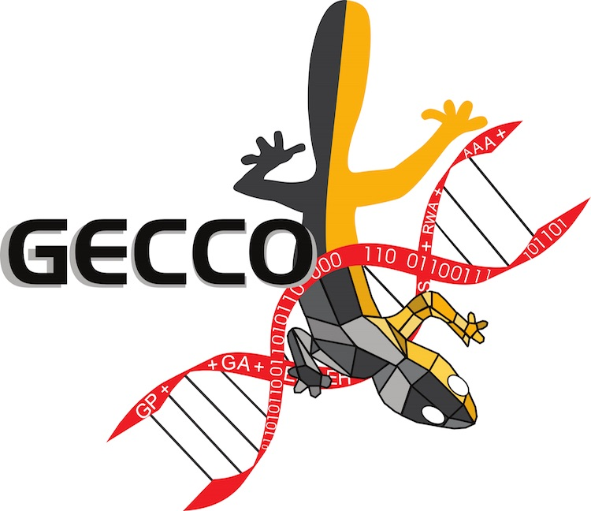
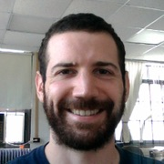
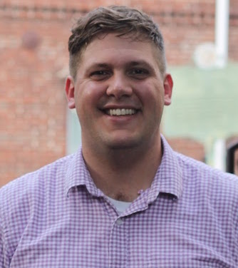
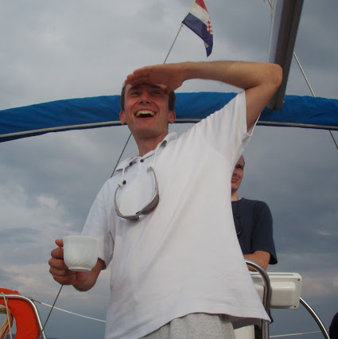
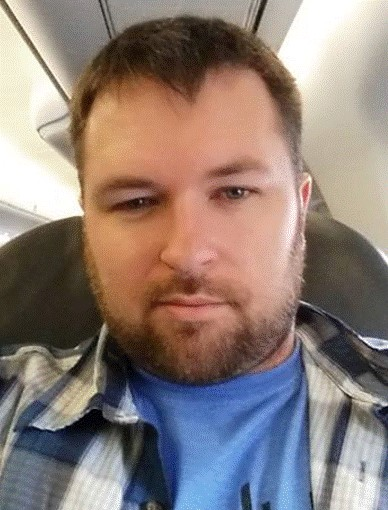

Date: TBD between July 15-16, 2017

Location: [Andel's by Vienna House Hotel](https://www.viennahouse.com/en/andels-berlin/the-hotel/overview.html) in Berlin, Germany @ [GECCO 2017](http://gecco-2017.sigevo.org/)

<!-- No schedule yet
### Schedule

TBD

-->

### Workshop Description

Benchmarks are one of the primary tools that machine learning researchers use to demonstrate the strengths and weaknesses of an algorithm, and to compare new algorithms to existing ones on a common ground. However, numerous researchers---including prominent researchers in the evolutionary computation field [[1](https://cs.gmu.edu/~sean/papers/gecco12benchmarks3.pdf), [2](http://dl.acm.org/citation.cfm?id=2330273), [3](https://dspace.mit.edu/openaccess-disseminate/1721.1/104909)]---have raised concerns that the current benchmarking practices in machine learning are insufficient: most commonly-used benchmarks are too small, lack the complexity of real-world problems, or are easily solved by basic machine learning algorithms. As such, **we need to establish new standards for benchmarking in evolutionary computation research** so we can objectively compare novel algorithms and fully demonstrate where they excel and where they can be improved.

This workshop will host speakers from around the world who will propose new standards for benchmarking evolutionary computation algorithms. These talks will focus on (i) characterizing current benchmarking methods to better understand what properties of an algorithm are tested via a benchmark comparison, and (ii) proposing improvements to benchmarking standards, for example via new benchmarks that fill gaps in current benchmarking suites or via better experimental methods. At the end of the workshop, we will host a panel discussion to review the merits of the proposed benchmarking standards and how we can integrate them into existing benchmarking workflows.

### Call for Papers

TBD

### Important Dates

Workshop paper submission deadline: March 27, 2017

Notification of acceptance: April 10, 2017

Camera-ready deadline: April 24, 2017

Registration deadline: TBD

### Paper Submission

TBD

### Organizers

This workshop will be organized by Drs. William La Cava, Randal S. Olson, Patryk Orzechowski, and Ryan J. Urbanowicz, all from the Institute for Biomedical Informatics at the University of Pennsylvania (Philadelphia, PA, USA).

[Dr. La Cava](http://www.williamlacava.com/) is a postdoctoral fellow who received his Ph.D. from the University of Massachusetts Amherst under Professors Kourosh Danai and Lee Spector. His research focus is system identification for dynamic systems in statistical genetics. He has contributed papers to GECCO in the genetic programming track on methods for local search and parent selection.

[Dr. Olson](http://www.randalolson.com) is a Senior Data Scientist working on open source software for evolutionary computation and machine learning research. Dr. Olson received his Ph.D. from Michigan State University, where he studied under Prof. Christoph Adami at the BEACON Center. He has been actively involved in GECCO for several years and won best paper awards at GECCO in 2014 and 2016 for his work in evolutionary agent-based modeling and automated machine learning.

[Dr. Orzechowski](http://home.agh.edu.pl/~patrick/) is a postdoctoral researcher in AI. He obtained his Ph.D. in Computer Science and a Masters of Automation and Robotics from AGH University of Science and Technology, Krakow, Poland. His scientific interests are in the areas of machine learning, bioinformatics and artificial intelligence. He also specializes in data mining and mobile technologies.

[Dr. Urbanowicz](http://www.ryanurbanowicz.com/) is a research associate with a Ph.D in Genetics from Dartmouth College and a Masters of Bioengineering from Cornell University. His research focuses on the development of rule-based machine learning methods for complex bioinformatics problems and complex data simulation for proper algorithm evaluation and comparison. At GECCO he has authored two best papers, and organized the rule-based machine learning workshop and tutorial for 4 years each.

